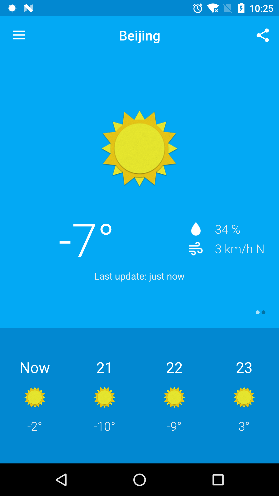
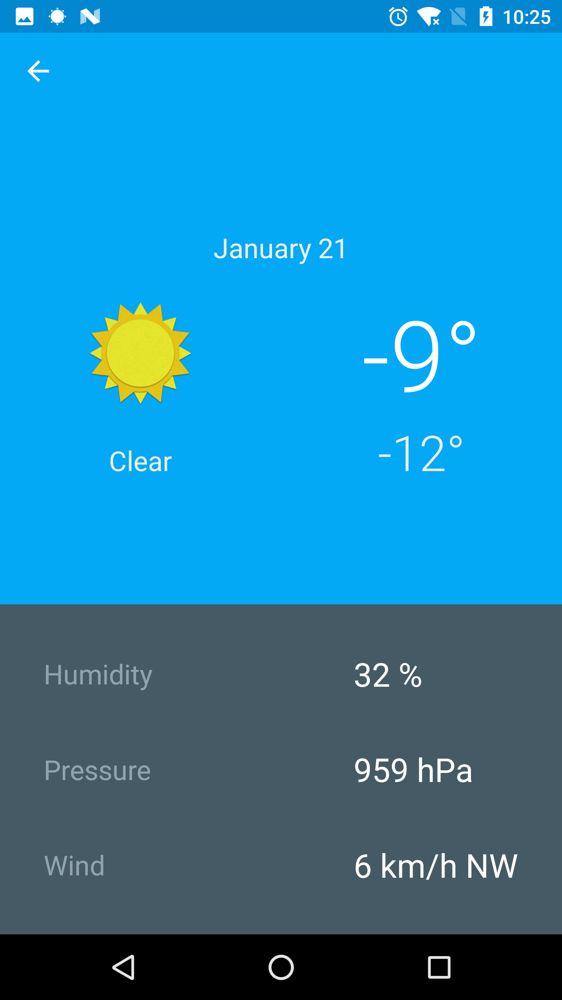
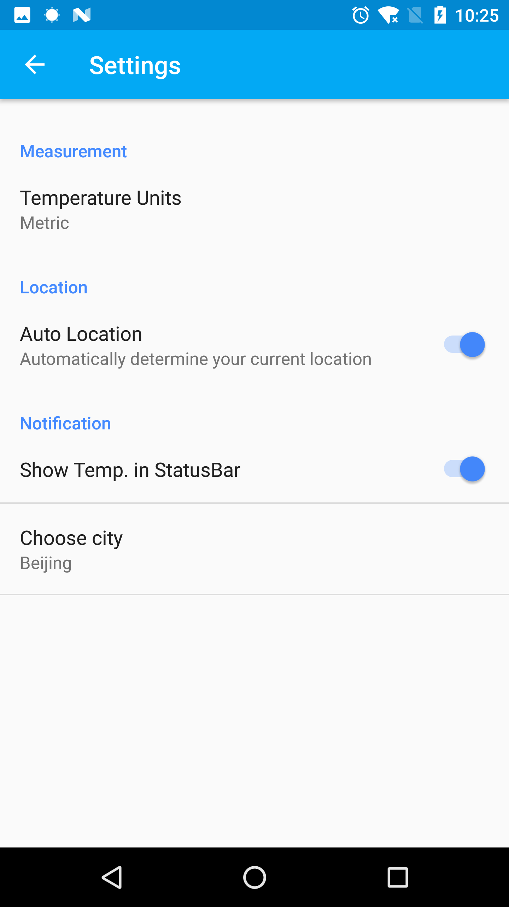
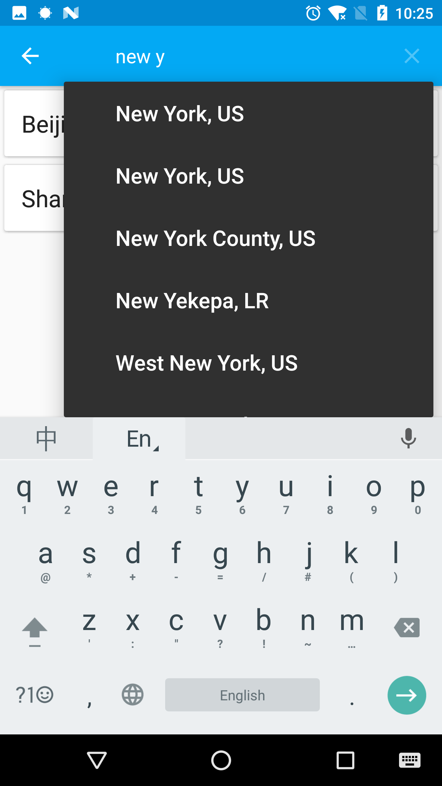

# OpenWeather

OpenWeather is an android weather application.
OpenWeather uses [OpenWeatherMap](http://openweathermap.org/) API

## Features

- MVP structure
- RxAndroid + Retrofit

## Screenshots

 
 
 
 
